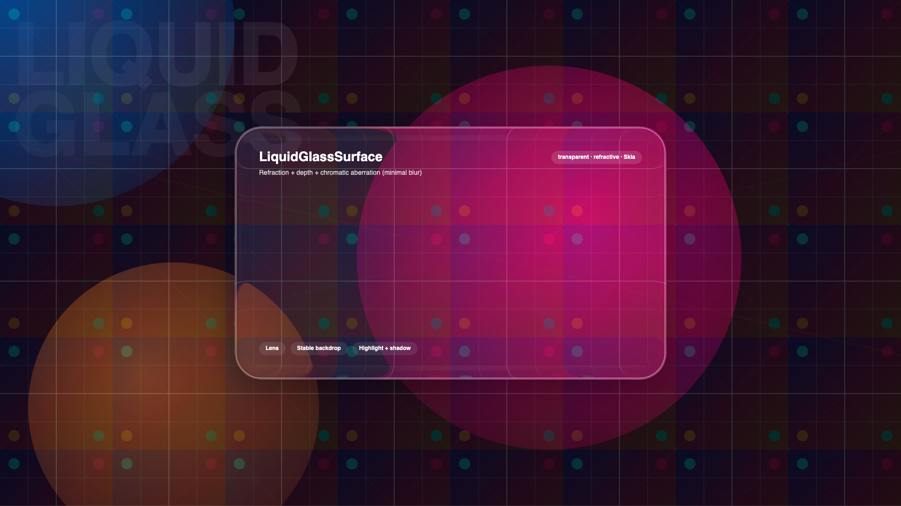
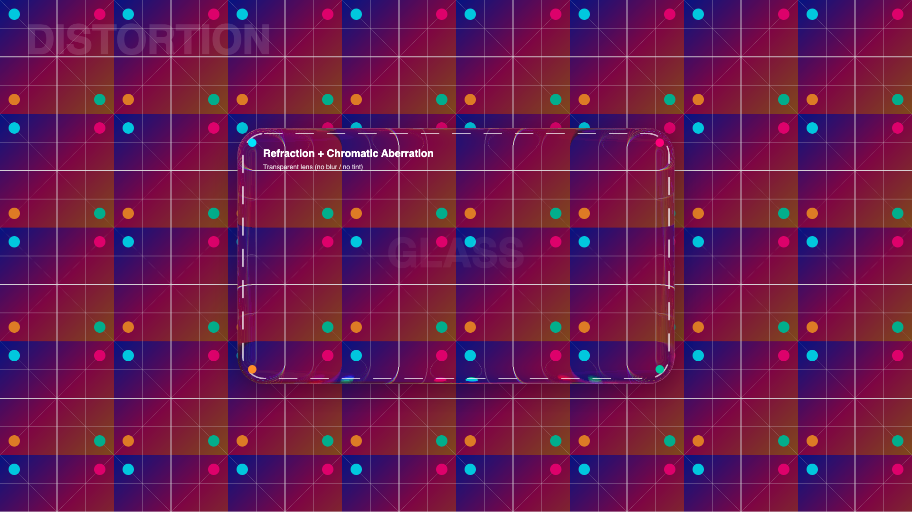
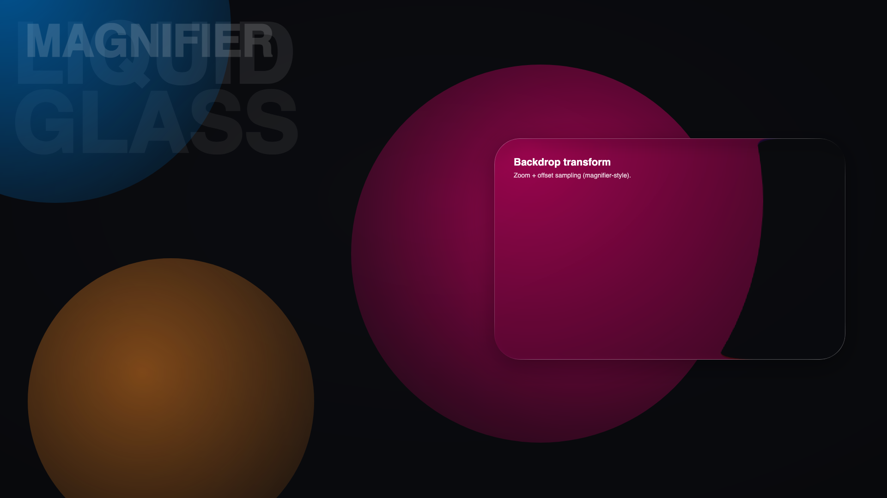
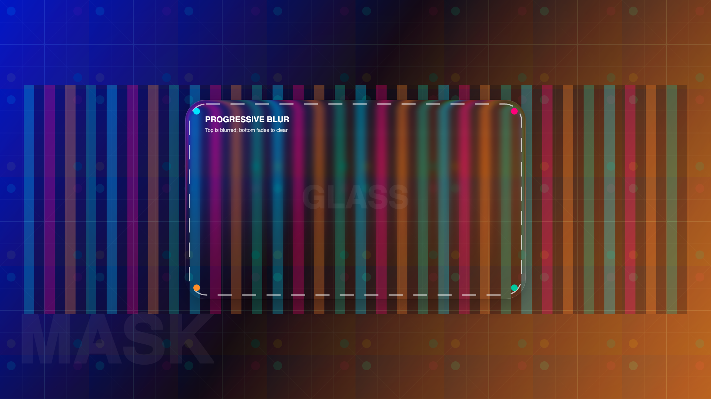

# LiquidGlassAvaloniaUI

An AvaloniaUI “liquid glass” backdrop effect: vibrancy → blur → rounded-rect lens refraction (optional dispersion) → edge highlight.

## 🎯 Overview

This project implements a composited backdrop pipeline using AvaloniaUI + SkiaSharp (`SKRuntimeEffect`) on Avalonia’s Skia renderer.

Requires the Skia renderer (`Avalonia.Skia`).

<https://github.com/user-attachments/assets/db4542f6-a24c-4b6b-ab51-4dbe688fccc6>

More headless-rendered examples:

| Distortion (refraction + CA) | Magnifier (zoom + offset) |
| --- | --- |
|  |  |

| Progressive mask blur |
| --- |
|  |

## 🚀 Quick Start

1. Clone the repository
2. Open the solution in your IDE
3. Run the `LiquidGlassAvaloniaUI.Demo` project to see the effects in action

The demo includes a floating draggable glass card for quick testing.

To validate rendering headlessly and optionally emit PNGs:

- `dotnet test LiquidGlassAvaloniaUI.sln -c Release`
- (optional) `LIQUIDGLASS_TEST_OUTPUT_DIR=./artifacts` to write `with-glass.png` / `without-glass.png`
- (optional) `LIQUIDGLASS_README_SCREENSHOTS_DIR=./docs/screenshots dotnet test LiquidGlassAvaloniaUI.Tests/LiquidGlassAvaloniaUI.Tests.csproj -c Release --filter FullyQualifiedName~ReadmeScreenshotGenerator` to (re)generate the screenshots above

## 📖 Usage

Recommended (new API):

- `LiquidGlassSurface` - A `ContentControl` that draws the liquid-glass pipeline behind its child and clips to `CornerRadius`.
- `LiquidGlassInteractiveSurface` - Adds press/drag deformation + interactive highlight.

## 🙏 Credits

- Inspired by [liquid-glass-react](https://github.com/rdev/liquid-glass-react/tree/master)
- Thanks to [Kyant0/AndroidLiquidGlass](https://github.com/Kyant0/AndroidLiquidGlass)
- Assisted by OpenAI Codex (GPT-5.2)
- Built with [AvaloniaUI](https://avaloniaui.net/)
- Powered by [SkiaSharp](https://github.com/mono/SkiaSharp)

## 📄 License

MIT License - see [LICENSE](LICENSE) file for details.
