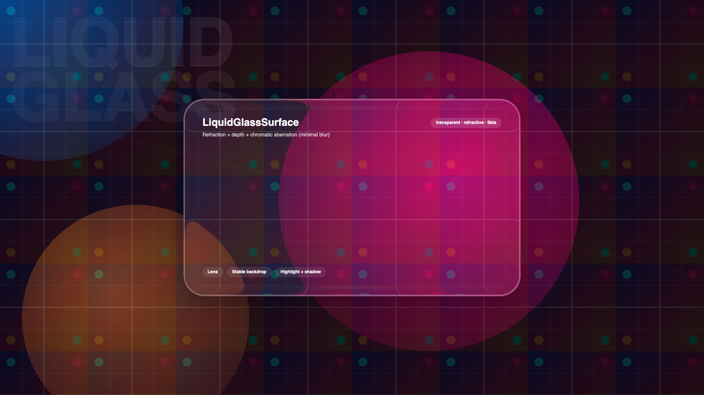
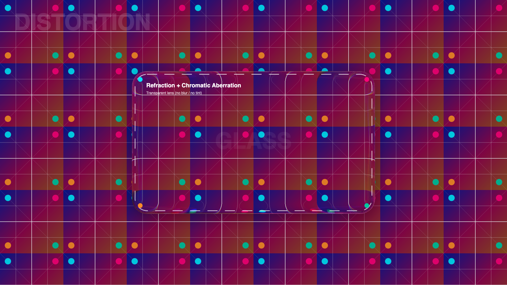
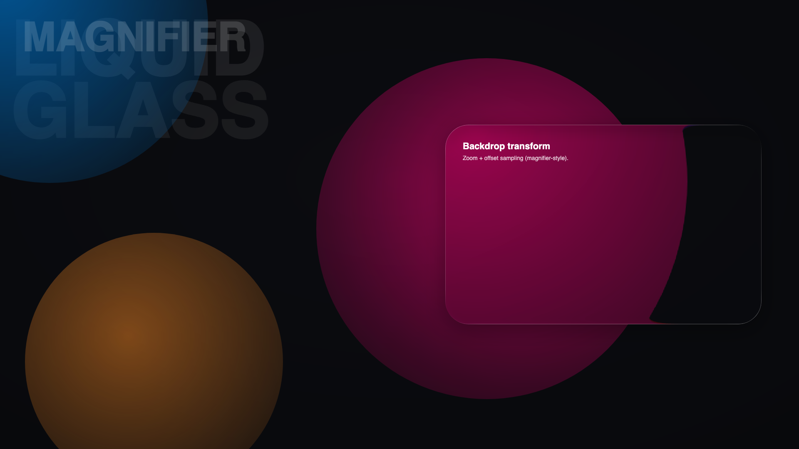
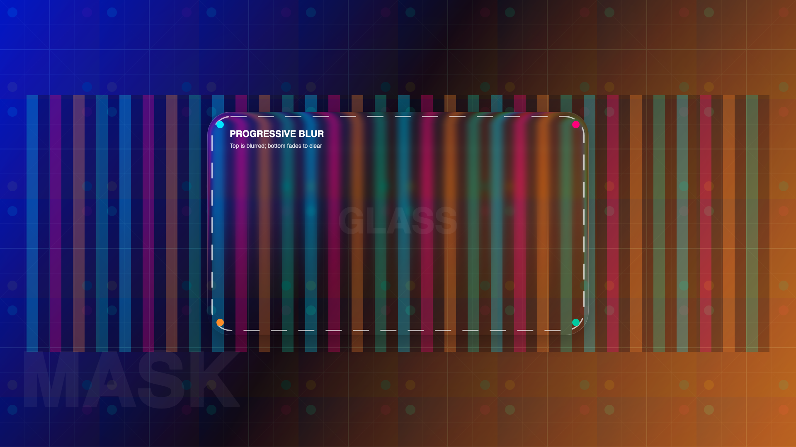

# LiquidGlassAvaloniaUI

[](https://github.com/KaranocaVe/LiquidGlassAvaloniaUI/actions/workflows/ci.yml)

An AvaloniaUI “liquid glass” backdrop effect: vibrancy → blur → rounded-rect lens refraction (optional dispersion) → edge highlight.

## 🎯 Overview

This project implements a composited backdrop pipeline using AvaloniaUI + SkiaSharp (`SKRuntimeEffect`) on Avalonia’s Skia renderer.

Requires the Skia renderer (`Avalonia.Skia`).



<https://github.com/user-attachments/assets/db4542f6-a24c-4b6b-ab51-4dbe688fccc6>

More headless-rendered examples:

| Distortion (refraction + CA) | Magnifier (zoom + offset) |
| --- | --- |
|  |  |

| Progressive mask blur |
| --- |
|  |

## 🚀 Quick Start

1. Clone the repository
2. Open the solution in your IDE
3. Run the `LiquidGlassAvaloniaUI.Demo.Desktop` project to see the effects in action

From the command line:

```sh
dotnet run --project LiquidGlassAvaloniaUI.Demo.Desktop/LiquidGlassAvaloniaUI.Demo.Desktop.csproj
```

The demo includes a floating draggable glass card for quick testing.

To validate rendering headlessly and optionally emit PNGs:

- `dotnet test LiquidGlassAvaloniaUI.sln -c Release`
- (optional) `LIQUIDGLASS_TEST_OUTPUT_DIR=./artifacts` to write `with-glass.png` / `without-glass.png`
- (optional) `LIQUIDGLASS_README_SCREENSHOTS_DIR=./docs/screenshots dotnet test LiquidGlassAvaloniaUI.Tests/LiquidGlassAvaloniaUI.Tests.csproj -c Release --filter FullyQualifiedName~ReadmeScreenshotGenerator` to (re)generate the screenshots above

## GitHub automation

- Pull requests and `main` pushes run the headless tests, desktop build, and Browser WASM publish.
- A green `main` push deploys the Browser Demo to Cloudflare Pages.
- Conventional Commits are collected by release-please into a Release PR. Merging it publishes the NuGet package, Browser Demo, and self-contained `win-x64`, `linux-x64`, and `osx-arm64` desktop archives.
- Configure the repository Secret `CLOUDFLARE_API_TOKEN` with Pages edit access before enabling Pages deployment.

## 📖 Usage

- `LiquidGlassSurface` - A `ContentControl` that draws the liquid-glass pipeline behind its child and clips to `CornerRadius`.
- `LiquidGlassInteractiveSurface` - Adds press/drag deformation + interactive highlight.

## 💡 Reflection

Developing this project has made me realize that **AvaloniaUI is still relatively immature when it comes to high-end visual effects.**

While the framework offers impressive cross-platform capabilities, there is still a significant gap in providing a "mature and seamless" experience for low-level rendering pipelines and advanced shader integration. Achieving these effects often requires fighting with the underlying APIs rather than working with the framework itself, highlighting the ongoing tension between flexibility and out-of-the-box usability in the current ecosystem.

## 🙏 Credits

- Inspired by [liquid-glass-react](https://github.com/rdev/liquid-glass-react/tree/master)
- Thanks to [Kyant0/AndroidLiquidGlass](https://github.com/Kyant0/AndroidLiquidGlass)
- Assisted by OpenAI Codex (GPT-5.2)

## 📄 License

MIT License - see [LICENSE](LICENSE) file for details.
